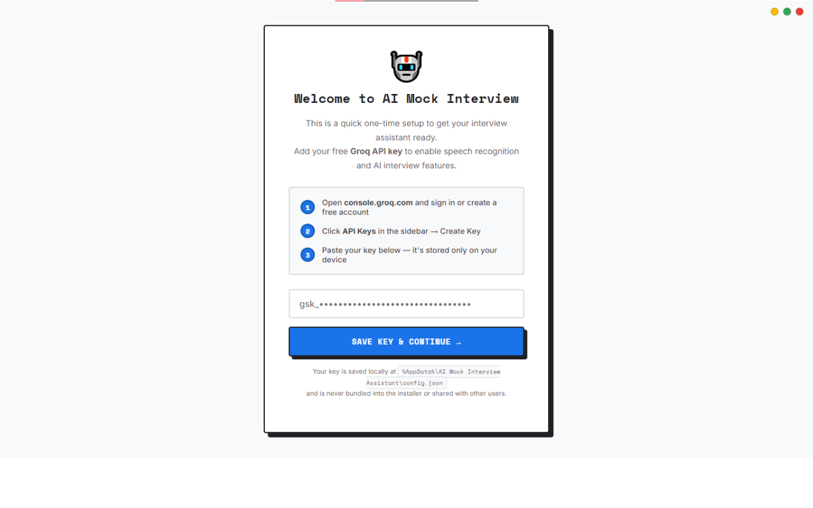
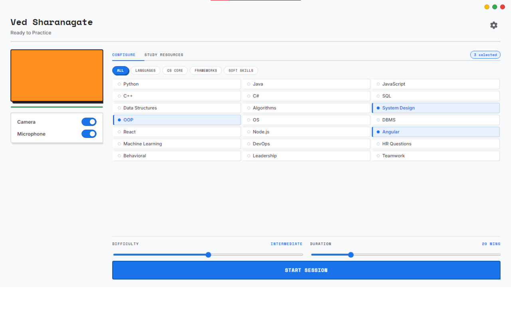
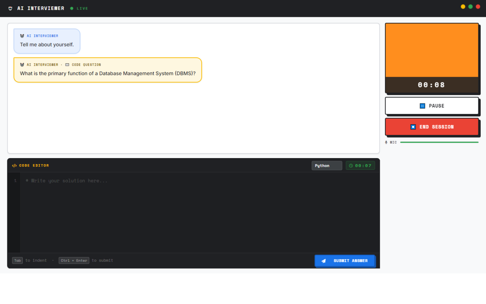
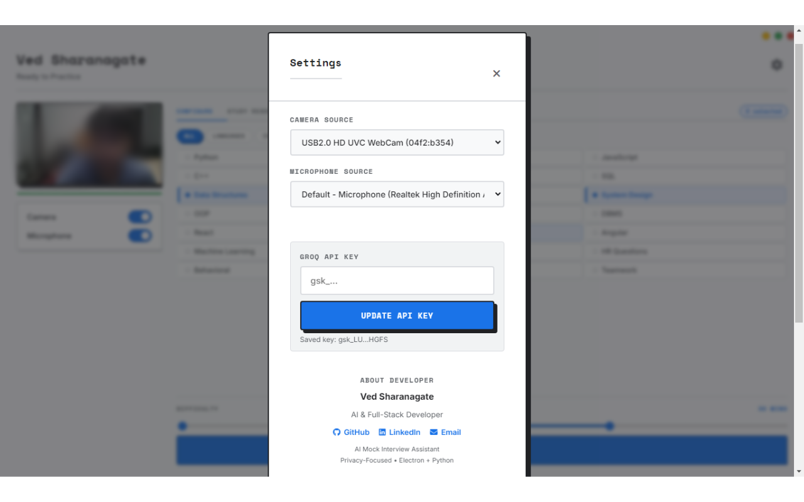
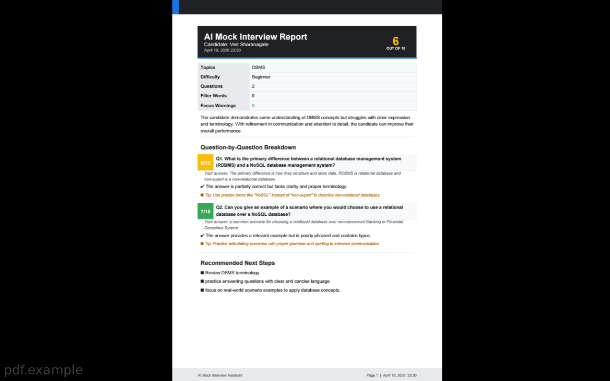
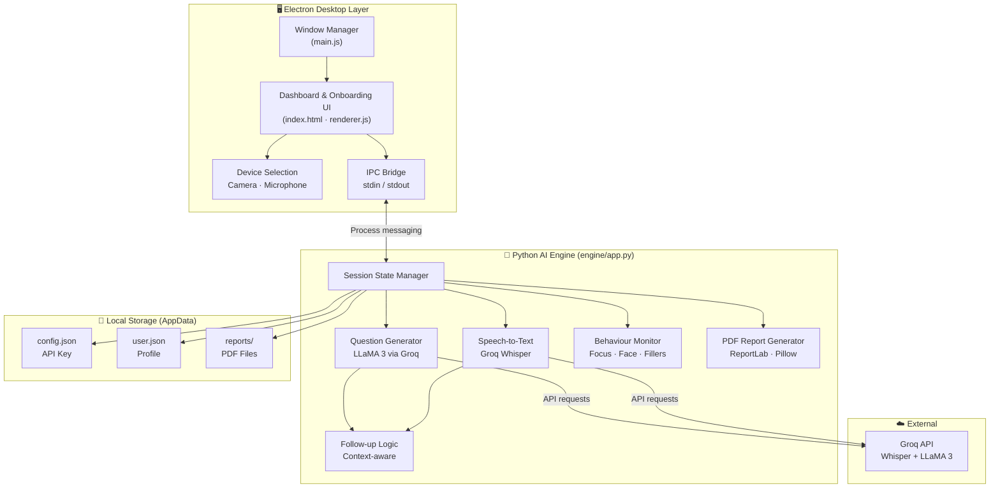

# AI Mock Interview Assistant

> A Windows desktop application for realistic, AI-powered interview practice — built with Electron and Python.

[](LICENSE.txt)
[]()
[]()
[]()
[]()

---

## ⚠️ Repository Notice

> **This repository is private and the source code is not publicly available.**
>
> This README is published for **portfolio and demonstration purposes only**. The codebase is kept private to protect the implementation. If you are a recruiter, collaborator, or evaluator and would like to review the source code, please reach out directly.
>
> 📧 [vedsharangate05@gmail.com](mailto:vedsharangate05@gmail.com)

---

## Academic Context

This project was developed as a **final-year college project** at the **Department of Computer Science & Engineering, Govindrao Wanjari College of Engineering and Technology, Nagpur** (affiliated with RTM Nagpur University).

The research paper based on this project — *"AI-Powered Mock Interview Assistant"* — was submitted, reviewed, and **presented at ICRTSET-2026** (International Conference on Recent Trends in Science, Engineering and Technology) on **April 6, 2026**, and has been accepted for publication.

| Detail | Info |
|---|---|
| Institution | Govindrao Wanjari College of Engineering & Technology, Nagpur |
| Department | Computer Science & Engineering |
| University | DBATU |
| Conference | ICRTSET-2026 |
| Presented | April 6, 2026 |
| Paper Status | Accepted for Publication |

---

## Overview

AI Mock Interview Assistant simulates a complete guided interview session on your desktop. Select topics, set a difficulty level, answer questions verbally or through the built-in code editor, and receive a structured PDF performance report at the end of every session.

The application follows a **local-first** architecture — there is no application-owned cloud backend. All user data stays on your machine.

- UI runs inside **Electron**
- AI engine runs in **Python**
- All user data and reports stored **locally**
- AI requests routed through **your own Groq API key**

---

## Features

### Interview Experience
- Topic-based session configuration from a central dashboard
- Domains: Programming, CS Fundamentals, Frameworks, SQL, Behavioral, Leadership
- Difficulty control before session start
- One-question-at-a-time flow with adaptive follow-up questions
- Built-in code editor for coding-style prompts

### Audio & AI
- Live speech-to-text transcription via **Groq Whisper**
- LLM-powered question generation and answer evaluation
- Text-to-speech playback for interviewer questions
- Real-time microphone activity visualization

### Session Controls
- Fullscreen interview mode
- Start, pause, resume, and end controls with a live timer
- Camera preview in dashboard and session views
- Camera and microphone device selection from Settings

### Behavioural Monitoring
- Focus warnings triggered when the window loses focus
- Camera-based face-presence detection during sessions
- Filler-word tracking across all answers
- Behavioural flag summary included in the final report

### Reporting
- Auto-generated PDF report on session completion
- Per-question scores and structured feedback
- Overall performance summary with recommended next steps
- Behavioural analysis section covering focus warnings and filler-word usage

---

## Screenshots

| First-Time Setup | Dashboard |
|:---:|:---:|
|  |  |
| *API key onboarding on first launch* | *Topic & difficulty selection dashboard* |

| Interview Session | Settings |
|:---:|:---:|
|  |  |
| *Fullscreen interview mode with live timer* | *Camera & microphone device selection* |

| PDF Report |
|:---:|
|  |
| *Auto-generated performance report with per-question scores and behavioural analysis* |

---

## Architecture


---

## Technology Stack

| Layer | Technology |
|---|---|
| Desktop UI | Electron, HTML, CSS, JavaScript |
| AI Engine | Python, Groq SDK, NumPy, sounddevice |
| Speech-to-Text | Groq Whisper API |
| Report Generation | ReportLab, Pillow |
| Configuration | python-dotenv |
| Packaging | PyInstaller, electron-builder |

---

## Project Structure

```
.
├── assets/
│   ├── icon.ico
│   └── style.css
├── build/
│   └── installer.nsh
├── engine/
│   ├── app.py
│   ├── engine.spec
│   └── runtime_hook_ssl.py
├── index.html
├── main.js
├── renderer.js
├── requirements.txt
├── package.json
├── build.bat
└── LICENSE.txt
```

---

## Application Flow

```
First Launch
└── Check for saved Groq API key
    ├── No key → Onboarding / setup screen
    └── Key found → Load user profile → Dashboard

Session
└── Select topics & difficulty
    └── Fullscreen interview mode
        ├── Engine asks one question at a time
        ├── User answers verbally or via code editor
        ├── Engine transcribes + generates follow-ups
        └── Focus & behaviour signals tracked

End of Session
└── Engine finalises Q&A set
    └── Evaluate answers
        └── Generate & open PDF report automatically
```

---

## First-Time Setup

On first launch, the application prompts for a **Groq API key**. This is by design — the app does not ship with an embedded key, as doing so in a desktop binary is a security risk. Each user authenticates AI usage through their own [Groq account](https://console.groq.com).

Keys begin with `gsk_` and are stored locally at:

```
%AppData%\AI Mock Interview Assistant\config.json
```

---

## Configuration & Data Storage

| File | Path |
|---|---|
| API key | `%AppData%\AI Mock Interview Assistant\config.json` |
| User profile | `%AppData%\AI Mock Interview Assistant\user.json` |
| PDF reports | `%AppData%\AI Mock Interview Assistant\reports\` |
| Engine crash log | `%AppData%\AI Mock Interview Assistant\engine-crash.log` |
| Engine stderr log | `%AppData%\AI Mock Interview Assistant\engine-stderr.log` |

**Privacy:** All data — API key, user profile, and session reports — is stored locally on your machine. No data is sent to any application-owned server.

---

## PDF Reports

Reports are generated automatically at the end of every session and opened immediately. Each report contains:

- Candidate name, interview topics, and difficulty level
- Question count, filler-word count, and focus warning count
- Overall rating and per-question scores
- Structured feedback and improvement tips
- Behavioural analysis section
- Recommended next steps

**Font support:** The PDF engine uses **Product Sans** when `engine/fonts/ProductSans-Regular.ttf` and `engine/fonts/ProductSans-Bold.ttf` are present, and falls back to Helvetica automatically if they are not.

---

## Troubleshooting

**`pyinstaller` is not recognized**
Use `build.bat`. The script installs and runs PyInstaller from the project virtual environment directly.

**`401 invalid_api_key` error**
Verify the saved key is a valid Groq key beginning with `gsk_`. Update it from the in-app Settings screen.

**Session does not start**
Confirm at least one topic is selected and the Python engine is running. Rebuild with `build.bat` if the engine bundle is outdated.

**PDF report is not generated**
Check the log files at:
```
%AppData%\AI Mock Interview Assistant\engine-crash.log
%AppData%\AI Mock Interview Assistant\engine-stderr.log
```

---

## Roadmap

- Demo video walkthrough (full session + PDF report)
- Research paper publication link
- Screenshot-rich README
- Refined onboarding and first-run UX
- Expanded interview packs with curated content
- Stronger report visualisation and analytics
- Optional managed backend mode
- Session history export and import

---

## License

This project is **proprietary and not open source**. The source code is kept private.

See [LICENSE](LICENSE) for full legal terms. In summary:

- Personal and educational reference use only
- Redistribution is not permitted without explicit written permission
- Commercial use is not permitted without explicit written permission
- Modification and derivative distribution are not permitted without explicit written permission

---

## Author

**Ved Sharanagate**  
B.Tech, Computer Science & Engineering  
Govindrao Wanjari College of Engineering and Technology, Nagpur  
📧 [vedsharangate05@gmail.com](mailto:vedsharangate05@gmail.com)
